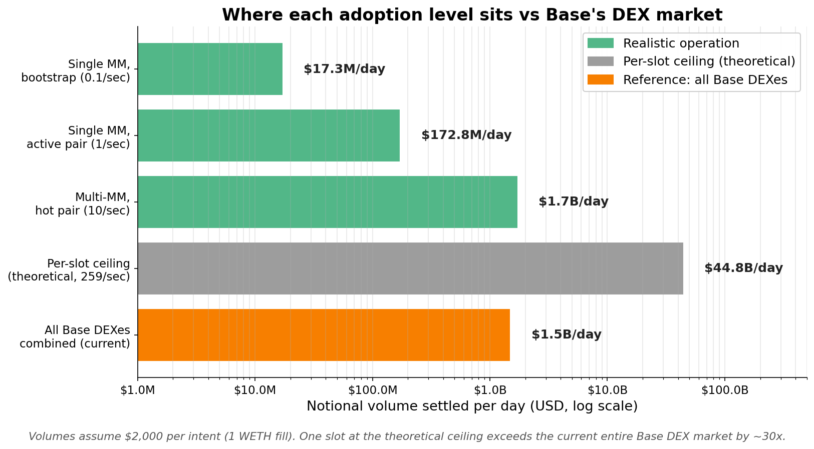

# PropAMM on Base: load test results

A 10,000-intent consolidated load test on Base Sepolia. Every intent was verified on chain by matching its witness hash against settlement events, and the result was independently re-checked by querying the chain directly.

The orchestrator-relayed path is the production default. All headline numbers below are from that path.

## Orchestrator-relayed

| Metric | Value |
|---|---:|
| Intents | 7,995 |
| Settled | 7,995 |
| Settlement rate | 100% |
| Gas per intent | ~83k (batch envelope amortised across the batch) |
| Cost per intent | ~$0.008 to $0.012 at current Base gas |
| Settlement latency | 2.1s p50, 3.2s p95 |

## Cost

Gas per intent falls as more intents share a batch, since the batch envelope is amortised across them. At current Base gas the orchestrator-relayed path runs about $0.008 to $0.012 per intent, and scales roughly linearly with the L1 base fee.

## Scale

## Execution modes

Every execution mode was exercised in the same run and settles end-to-end.

| Mode | Result |
|---|---|
| Orchestrator-relayed (default) | 100% (7,995 / 7,995) |
| Self-relay, self-supplied price | settles |
| Cross-venue routing | settles |
| Mixed PropAMM + external venue | settles |
| ERC-8211 fee-split | settles |
| Piggyback (rides the orchestrator's anchor) | settles when the trader's tx shares a block with an orchestrator batch, the common case on active pairs |

## How it was verified

Each intent's witness hash is recorded at submit time. After the last submission the harness waits for the system to go quiet (every self-relay receipt confirmed and orchestrator settlements stopped arriving) before snapshotting, then reconciles every hash against `IntentSettled` / `IntentFailed` events. An independent re-query of the chain confirmed 9,967 settled across all modes, with zero orchestrator-relayed failures (verified by the tx sender of every failed event).

## Latency

Orchestrator-relayed settlement is **2.1s p50, 3.2s p95**, measured from the settled event's block timestamp minus submit time (true on-chain settle time, not observation lag). That is about one Base block after dispatch plus the batcher's 200ms flush window. The batcher flushes a pair's bucket when it reaches 20 intents or 200ms, whichever comes first.

## Throughput

The run sustained about 6.5 intents/sec of submission. That ceiling is the test harness, which signs each intent with an RPC round-trip and submits self-relay intents sequentially through a single trader EOA. It is not the RPC endpoint (a private Alchemy URL) and not the protocol. On the protocol side, the batcher flushes up to 20 intents every 200ms and the 32-EOA relayer pool dispatches many batches per block, so the architectural ceiling is far higher.
