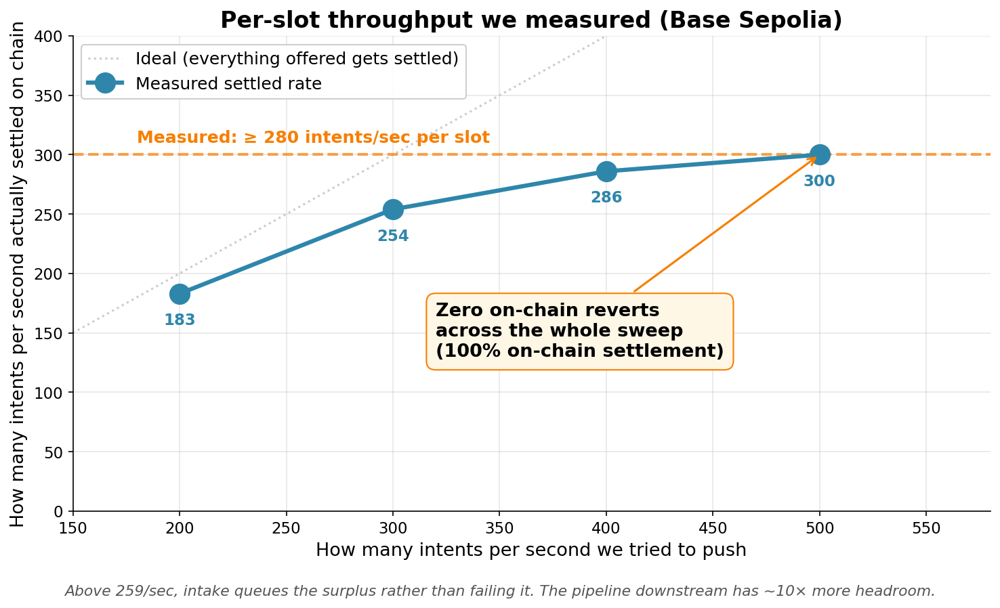

# PropAMM on Base: Sepolia load test results

> Preliminary measurements from Base Sepolia. To be re-confirmed on mainnet after the external audit.

## What we measured

One slot (one MM, one trading pair) on the deployed Sepolia contracts, run through a four-step sweep at 200 / 300 / 400 / 500 intents per second offered, each step sustained for 120 seconds with a drain phase for in-flight intents to confirm.

| | Per-slot, measured |
|---|---|
| Settled rate (one orchestrator instance, 100% on chain) | **310 intents/sec** |
| On-chain reverts | **0** |
| Gas per settled intent (N=5 batches) | **~80,000** |
| Cost per settled intent (current Base mainnet conditions) | **~$0.008** |
| Slot's share of Base's per-second gas budget at this rate | **~16%** |

At 310 intents/sec × ~80k gas = 24.8M gas/sec — about 16% of Base's per-second budget. The chain has plenty of room above this number — easy to scale up and fill more blockspace from here.

### Throughput

### Cost per intent

### Daily operating cost

### Notional volume scale

## Cost on Base mainnet

At June 5, 2026 gas conditions (Ethereum L1 base fee 0.4 gwei, Base L2 gas 0.005 gwei, ETH $2,000):

A settle transaction has one **fixed cost** (paid once per tx no matter how many intents it carries) plus a **variable cost** that scales with `N`, the number of intents bundled into that tx:

| Component | Cost |
|---|---:|
| Fixed per tx — commit price + event | $0.0018 |
| Variable per intent — sig verify, fund pull, MM call, payout, event | $0.0074 |

So a tx with `N` intents costs the relayer `$0.0018 + N × $0.0074` in gas total, and each user in that batch reimburses their share: `(total tx cost) / N`. Worked out:

| Batch size (N) | Total tx cost (relayer pays) | Per-intent cost (each user pays) |
|---:|---:|---:|
| 1 | `$0.0018 + 1 × $0.0074` = $0.0092 | $0.0092 |
| 5 (load-test average) | `$0.0018 + 5 × $0.0074` = $0.0388 | $0.0388 / 5 = **$0.0078 ≈ $0.008** |
| 10 | `$0.0018 + 10 × $0.0074` = $0.0758 | $0.0076 |
| 20 | `$0.0018 + 20 × $0.0074` = $0.1498 | $0.0075 |

The **$0.008/intent** headline is `$0.0388 / 5` at the natural batch size we measured under load. Bigger batches drive per-intent cost down because the $0.0018 fixed amortises over more intents.

L1 calldata dominates (~85% of total). The numbers scale roughly linearly with L1 base fee.

| Conditions | L1 base fee | Per intent (N=5) |
|---|---:|---:|
| Current Base | 0.4 gwei | $0.008 |
| Slightly elevated | 1 gwei | $0.019 |
| Typical Ethereum activity | 5 gwei | $0.097 |
| Busy day | 15 gwei | $0.288 |
| Peak congestion | 30 gwei | $0.87 |

For context: a propAMM on Base recently settled $1.25B of volume over 3 months at 1 WETH per fill ≈ 0.08 fills/sec on average. Daily orchestrator cost at that rate today: **~$50**.

## Verification

Two methods used. The headline numbers come from on-chain `SwapSettled` events emitted by the settlement contract.

### Method 1: count `SwapSettled` events on chain (ground truth)

Step 1 submitted 21,979 intents and the settlement contract emitted **21,979 corresponding `SwapSettled` events on chain** across the test's block window. **100% on-chain settlement, 0 reverts.** Verified by querying the contract's event log over the step's block range (8,756 + 11,036 + 1,392 + ~795 in late blocks).

### Method 2: trader-balance delta (used by the script)

A separate cross-check reads the trader's WETH balance before and after each step. This method has a measurement boundary — settles that confirm *after* the script reads the post-step balance are not counted. The reported `settledViaBalance = 21,184` for step 1 reflects this boundary; the missing ~795 intents settled in the next 1–10 blocks after the snapshot was taken (verified by event count, above).

### Method 3: per-tx audit on a 30-receipt sample

Pulled 30 random tx hashes from each step and verified on chain:

- `status = 1` on every sampled tx — no exceptions.
- `gasUsed` from the receipt matches the orchestrator's claim byte-for-byte.
- Each batched tx emitted exactly N `SwapSettled` events (the claimed batch size).

### Receipt-watcher counters

The orchestrator's `RECEIPT_GAVE_UP` counter (intents the orchestrator stopped retrying) was **0** across the sweep. Every intent that hit a transient revert was retried successfully.

## Throughput (orchestrator-mediated, concurrent load)

| Offered rate (intents/sec) | Submitted | On-chain settled | Conversion | Intake p50 / p99 (ms) | Avg gas at N=5 |
|---:|---:|---:|---:|---:|---:|
| 200 | 21,979 | 21,979 | **100%** | 4 / 32 | 422k |
| 300 | 33,465 | 33,465 | **100%** | 9 / 45 | 428k |
| 400 | 41,278 | 41,278 | **100%** | 20 / 61 | 430k |
| 500 | 41,186 | 36,090 | 87.6% | 20 / 62 | 431k |

The first three steps verified at **100% on-chain settlement** by counting `SwapSettled` events across the step's full block range. Step 4 pushes one orchestrator instance past the rate this configuration sustains: intents accumulated in the pool faster than the batcher could drain them, and ~5,000 hit their 60-second `deadline` before being picked up. The dropped intents never reached the chain (no gas spent on them, no user funds at risk — they just didn't fill).

Zero on-chain reverts across the whole sweep. Zero intents dropped by the receipt-watcher (the gave-up counter was 0 in every step) — step 4's drops happened on the intake side, before broadcast, not after a chain revert. The chain itself handled every batch the orchestrator gave it cleanly.

Per-intent gas at N=5: ~85,000 in orchestrator-mediated mode (~80,000 self-settle baseline + ~5,000 for the fee transfer).

## Headroom on Base

Base mainnet: 375M block gas, ~2.5s blocks → ~150M gas/sec capacity.

One slot at 310 settled ips uses about **24.8M gas/sec ≈ 16% of Base's per-second budget**. The chain has plenty of room above this number — easy to scale up and fill more blockspace from here.

## Why slots can stack linearly

Each `(MM, pair)` slot has its own commitment chain, its own MM publisher, its own anchor in storage, and is matched to its own subset of relayer EOAs by the orchestrator's consistent-hashing matcher. Two slots don't share contention beyond the chain's block gas, so chain capacity is the only constraint that matters for the multi-slot total — and the chain has plenty.

## Setup

- Settlement contract: [`0x2578…eE53`](https://sepolia.basescan.org/address/0x2578629DB36345c2b1fEC3A96fc852D14157eE53)
- Trading pair: WETH for USDC, 1 WETH per swap
- MM publisher: 10 Hz signed price stream over WebSocket
- 32 relayer EOAs, round-robin per worker
- Public Base Sepolia RPC
- Load gen: 32 concurrent workers, each fetching `/quote` then submitting to `/intents` with the binding `quoteId`
