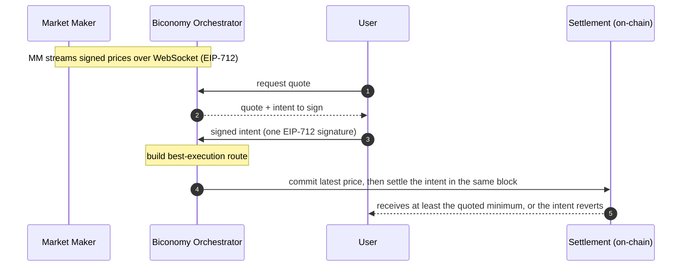

# Biconomy x Base: Increasing PropAMM volumes on Base

A settlement layer for proprietary market makers on Base, built and load-validated on Base Sepolia.

---

## The opportunity for Base

Proprietary AMMs deliver tighter spreads and better prices than passive AMMs because market makers can actively manage adverse selection rather than absorbing it. On Solana, propAMMs generate $3 to $5B in monthly volume and have at points commanded the majority of DEX flow on the chain. The category has proven itself where the infrastructure conditions allow it to work.

On Base, up to five propAMMs have been live since November 2025. Together they have generated roughly $5 to $6B in all-time volume, but their share of total Base DEX volume sits at only 2 to 3%. During volatile markets, when price freshness matters most and propAMM advantages should be strongest, that share has briefly spiked to 22% and then collapsed back. The category is structurally capped. Not because of weak products, but because of a missing infrastructure primitive.

---

## Why propAMMs on Base are stuck

In a propAMM, the market maker signs prices off-chain and those prices commit to an on-chain anchor when a swap settles. Between an off-chain market move and the next on-chain price refresh, the on-chain price is stale relative to live markets.

Latency-advantaged bots exploit that gap. A bot watches a centralised exchange feed, and when the off-chain market moves it fires a swap against the stale anchor with an inline slippage check. If the swap lands before the MM's next price update, the bot fills at the stale price and closes off-chain at the new one. If it lands after, the check reverts and the bot only pays gas. The expected value is positive whenever the off-chain move is larger than the MM's spread inside the staleness window.

Widening spreads does not solve it. The bot just fires on bigger moves, and the MM gets priced out of organic flow. The end state is toxic-only flow at any spread tight enough to compete with Uniswap or Aerodrome.

We have direct confirmation from one institutional market maker who ran a permissionless propAMM on an L2:

- Every spread width they tried produced toxic-only flow.
- User-side gas penalties did not deter the bots. Per-pickoff value exceeded the gas paid on reverts.
- Organic flow never appeared at competitive spread levels.

That market maker shut down their permissionless channel and restricted execution to a curated allowlist plus per-order RFQ. They have told us they would return to a permissionless standard if toxic orders were eliminated at the infrastructure level.

---

## How Ethereum L1 solved it, and why Base is the right home

On L1, specialised block builders (Titan most prominently) order MM price updates at the top of every block they build. A bot's swap arriving before the MM's update still lands after it inside the block, so the bot fills against the refreshed price. The protection comes from competing builders, only applies in their blocks, and MMs pay for it indirectly through MEV-Boost.

We solve the same problem at the contract layer instead. Our stack is chain-agnostic, but Base is the right home to operate it:

- **Single sequencer with a private mempool.** No public-mempool front-running of MM updates, so one class of toxic flow is already gone before our enforcement even applies.
- **Flashblocks (~200ms pre-confirmations) and ~2s blocks.** The faster cadence structurally shrinks the residual intra-block staleness window. On L1 with 12s blocks the equivalent window is several times wider.
- **Retail-viable economics.** Around $0.008 per fill at current Base gas, versus $0.10 or more on L1. This makes per-fill propAMM economics work down to small ticket sizes.

The contract-level enforcement we ship, built on ERC-8211 predicates developed with the Ethereum Foundation, is the new primitive. Base is the right operational home for it.

---

## How it works

Three ideas carry the whole design. The detail lives in the integration docs; here is the shape.

### 1. ERC-8211 builds the route, with the user's guards baked in

For every intent, our stack builds the calldata that fulfils it using ERC-8211 composable execution. That calldata can be constrained and composed in different ways: route through a proprietary MM, through an external venue, split across both, or run a runtime-balance step like a fee split, all in one execution. The user's protections travel inside that calldata. The receiver must end up with at least the quoted minimum or the whole thing reverts, token pulls are bounded by what the user signed, and the route can only touch what we allow it to. The user gets best execution and cannot be shortchanged.

### 2. Same-block price freshness kills toxic flow, enforced by the contract

The settlement contract enforces, on every fill, that the MM price it settles against was committed on-chain in the same block. We always commit the latest signed price first, in the same block, before any intent settles against it. A stale price simply cannot be used. This is enforced as a standard of EVM execution that every node checks deterministically, not as a custom block-builder service that depends on a specific builder winning the block. There is no MEV-Boost dependency and no builder market to maintain. That property is what closes the cross-block stale-anchor vector that has historically been the dominant toxic-flow path on permissionless L2 propAMMs.

### 3. We abstract the whole execution cycle; everyone just signs

MMs and users never touch gas, routing, or transaction ordering. MMs stream signed prices. Users sign one intent. Everything between, building the route, committing the fresh price ahead of the fill, ordering price updates and intents within the block, paying gas, and submitting on-chain, is handled by our orchestrator off-chain and our settlement layer on-chain.

---

## MM commitments

The second largest on-chain market maker by volume has committed to deploy on this standard on Base. The institutional MM who experienced toxic-only flow and shut down their permissionless channel has told us they would move to this standard once toxic orders are eliminated at the infrastructure level.

---

## Performance

Load-validated on Base Sepolia with a 10,000-intent consolidated run. We measure headline reliability from the production path (orchestrator-relayed intents), the surface where stale prices and nonce clashes cannot occur:

- **Orchestrator-relayed settlement at 100% under sustained load** (7,995 of 7,995), every intent verified on-chain.
- All other execution flows (self-relay, cross-venue, mixed routes, ERC-8211 fee-split) validated end-to-end.
- Around $0.008 per fill at current Base gas.

Full per-channel results, latency, and verification methodology are in [performance-summary.md](./performance-summary.md).

---

## What this means for market makers

- **You only stream signed prices.** No gas, no on-chain transactions, no routing. Publish EIP-712 price updates over a WebSocket and you are live.
- **You set your own pricing.** Your on-chain provider decides the output it delivers from the committed price, applying whatever curve, spread, or inventory logic you want. Our layer never prices the trade for you.
- **You are protected from stale-price pickoff.** The same-block freshness rule that protects users protects you too. You cannot be settled against an old price.
- **Your signing key is the only thing that matters.** Every other component is signature-enforced or has no authority over funds. A compromised relayer can only waste its own gas.

---

## What we would like to explore with Base

The settlement standard is built and load-validated, and two market makers are committed or conditionally committed to deploy on it on Base.

The contract-level enforcement handles the cross-block stale-anchor case structurally. The remaining residual is the sub-second drift between consecutive MM signatures inside a single block, which is the natural fit for Flashblocks. We would like to scope with Base how Flashblocks ordering composes with our contract-level predicate to close that residual end to end. Joint design from here, joint launch, joint volume credit to Base.
