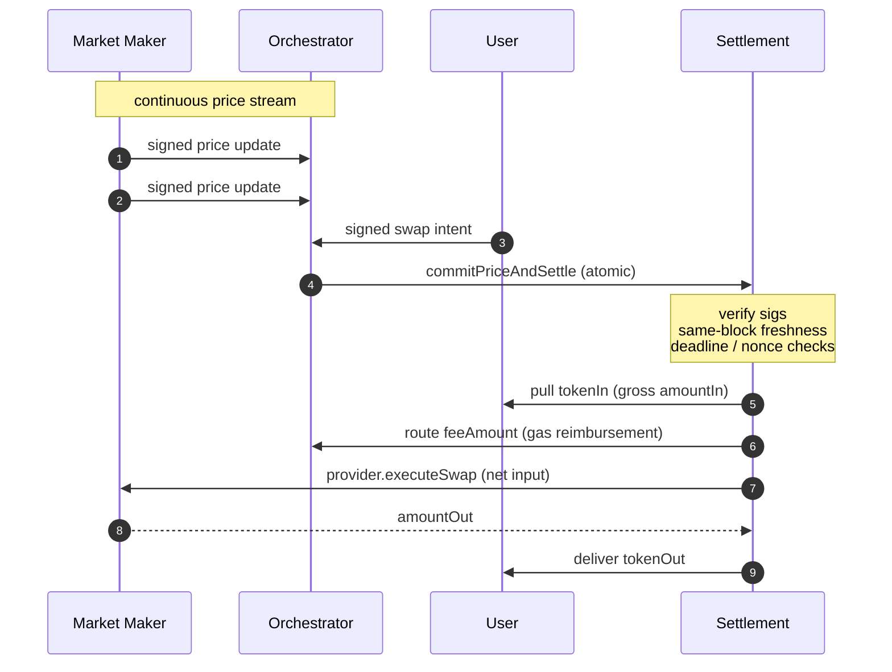
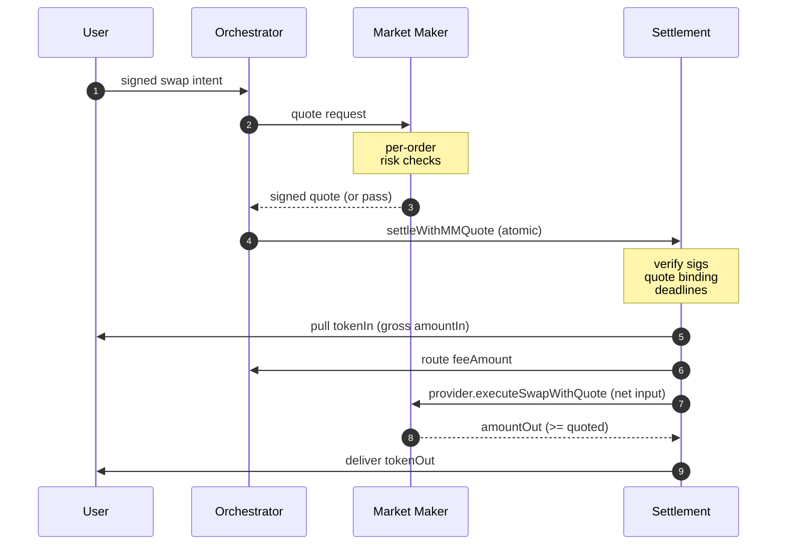

# Biconomy x Base: Increasing PropAMM volumes on Base

A settlement layer for proprietary market makers on Base, built and load-validated on Base Sepolia.

---

## The Opportunity for Base

Proprietary AMMs deliver tighter spreads and better prices than passive AMMs because market makers can actively manage adverse selection rather than absorbing it. On Solana, propAMMs generate $3–5B in monthly volume and have at points commanded the majority of DEX flow on the chain. The category has proven itself where the infrastructure conditions allow it to work.

On Base, up to five propAMMs have been live since November 2025. Together they have generated approximately $5 to $6B in all-time volume. Their share of total Base DEX volume sits at 2 to 3%. During volatile markets, when price freshness matters most and propAMM advantages should be strongest, that share has briefly spiked to 22%, then collapsed back. The category is structurally capped, not because of weak products, but because of a missing infrastructure primitive.

---

## Why propAMMs on Base are stuck

### Toxic Flow Problem

In a propAMM, the market maker signs prices off-chain. Those prices commit to the on-chain anchor when a swap settles. Between off-chain market moves and the next on-chain anchor refresh, the on-chain price is stale relative to live markets.

Latency-advantaged bots exploit this gap. The bot maintains a feed from a centralised exchange and a co-located connection to the sequencer. When the off-chain market moves, the bot fires a swap against the stale anchor with an inline slippage check. If the swap lands before the MM's next price update, the bot fills at the stale price and closes off-chain at the new price. If it lands after, the check reverts and the bot just pays gas. The expected value is positive whenever the off-chain move is larger than the MM's spread within the staleness window.

Widening spreads does not solve it. The bot just fires on bigger moves, and the MM gets priced out of organic flow at wider spreads. The end state is toxic-only flow at any spread tight enough to compete with passive AMMs like Uniswap or Aerodrome.

We have direct confirmation from one institutional market maker who ran a permissionless propAMM on an L2:

- Every spread width they tried produced toxic-only flow.
- User-side gas penalties did not deter the bots. Per-pickoff value exceeded the gas they paid on reverts.
- Organic flow never appeared at competitive spread levels.

That market maker shut down the permissionless channel and restricted execution to a curated allowlist plus per-order RFQ. They have indicated they would return to a permissionless standard if toxic orders were eliminated at the infrastructure level.

---

## How Ethereum L1 solved it, and why Base is the right home

On L1, specialised block builders (Titan most prominently) order MM price updates at the top of every block they build. A bot's swap arriving before the MM's price update still lands after the update inside the block, so the bot fills against the refreshed price. The protection emerges from competing builders and only applies in their blocks; MMs pay for it indirectly through MEV-Boost.

We solved the same problem at the contract layer instead. Our stack is chain-agnostic by design — the settlement contract and orchestrator can deploy on any EVM. What makes **Base the right home** to operate it on:

- **Single-sequencer model with a private mempool.** No public-mempool front-running of MM updates. The chain's existing sequencing model already removes one class of toxic flow that L1 has to solve with builder competition.
- **Flashblocks (~200ms pre-confirmations) and ~2–2.5s block time.** The faster cadence shrinks the residual intra-block staleness window structurally. On L1 with 12s blocks, the equivalent window is ~5× wider.
- **Retail-viable economics.** ~$0.008 per intent end-to-end at current gas (vs L1's ~$0.10+). Makes per-fill propAMM economics work down to small ticket sizes.

The contract-level enforcement we ship (ERC-8211-predicate-based, developed in collaboration with the Ethereum Foundation) is the new primitive. Base is the right operational home for it.

---

## What's been built

### Architecture

Two layers, with a clean interface between them.

#### Layer 1: Shared settlement substrate

One contract per chain, identical for every MM. It handles EIP-712 verification of the user's signed intent and the MM's signed price or per-order quote, pulling the user's `tokenIn` via standard approve, ERC-2612 permit, or Permit2 with intent-hash witness, storing the latest signed anchor price per `(MM, tokenIn, tokenOut)` with freshness gates that fire at settle time, calling into the MM's provider contract for the actual fill, and enforcing atomicity. Funds move through the settlement contract and out within the same transaction; the contract never holds a non-zero balance. Single-use user intent nonces, monotonic MM nonces, deadlines, and optional exclusivity windows are enforced at this layer.

#### Layer 2: Per-MM provider contract

Each market maker deploys their own. It implements a small interface the settlement contract calls during every fill. Inside, the MM has full control: curve-based price padding, counterparty filtering, freshness checks against MM-side state, per-pair fill caps, per-order signed quoting. The settlement contract has no opinion on the internal logic. The provider returns an `amountOut` or reverts; settlement handles either outcome safely.

#### Two settlement flows

*Streaming.* The MM publishes signed prices continuously. The orchestrator commits the freshest signed price as the on-chain anchor and settles user intents against it. Multiple intents against the same `(MM, pair)` can settle in one batched transaction.

*Pin-RFQ.* For each user intent, the orchestrator sends a quote request to the MM. The MM runs its own risk checks and either signs a binding quote or declines. Settlement treats the signed quote as a floor on the user's `amountOut`. The MM can pay more; they cannot pay less.

Both flows happen in a single transaction. Any step that fails reverts the entire transaction.

#### Same-block freshness enforcement

The settlement contract enforces, on every fill, that the MM-signed price was committed in the same block as the swap. The check is at the contract level, not at the user level. We use ERC-8211 predicates developed in collaboration with the Ethereum Foundation to express this constraint.

This is how we enforce ordering: as a **standard of EVM execution** — every node verifies it deterministically as part of the normal settle path — rather than as a custom block-builder application that depends on a specific builder being in the lead. There is no MEV-Boost dependency, no Titan-style builder market to maintain, no per-block competition to win. The constraint is part of the contract; it holds on every node, every block, every time. Any chain that runs the EVM can deploy this without bringing along a custom builder stack.

That property — ordering enforced by the EVM itself, not by who built the block — is what closes the cross-block stale-anchor vector that has historically been the dominant toxic-flow path on permissionless L2 propAMMs.

#### Channel choice

Streaming fits an MM that has a fast external price feed to mirror, wants high-throughput open access, and can sign at machine speed from a hot wallet. Pin-RFQ fits an MM that wants per-order signoff, signs from slow infrastructure (HSM or multisig), or applies off-chain risk gates per fill. Users sign the same intent type either way. One MM signing key can run both channels side by side.

### User and MM protection

Same-block freshness enforcement (above) closes the cross-block stale-anchor vector — the dominant path that took down the institutional MM mentioned earlier. Both sides benefit: MMs are protected from prior-staleness pickoff; users cannot be silently settled against a multi-block-old anchor.

A residual remains: drift between consecutive MM signatures within a single block (~200–500ms at typical 5–10 Hz publishing cadence). Base's Flashblocks and sequencer model are where this residual gets compressed further; we have the contract-level primitive ready to compose with that.

For the MM, the operational requirement is to keep publishing signed prices on active pairs. Everything downstream is the orchestrator's problem.

### MM Commitments

The second largest on-chain market maker by volume has committed to deploy on this standard on Base. The institutional MM who experienced toxic-only flow and shut down their permissionless channel has indicated they would move to this standard if toxic orders are eliminated at the infrastructure level.

### Performance

Preliminary numbers from Base Sepolia. We'll re-confirm on mainnet after the external audit.

One orchestrator instance, one slot (one MM, one pair), settles **310 intents per second, 100% on chain, 0 reverts**, in the orchestrator-mediated path users will take. Verified by counting `SwapSettled` events on chain (not from orchestrator logs) across the test's block range.

Per settled intent at 5-intent batches:

- **~80,000 gas** on chain.
- **~$0.008** at current Base mainnet conditions (June 5, 2026: L1 base fee 0.4 gwei, ETH $2,000).

At 310 intents/sec per slot, we're using about **16% of Base's per-second gas budget**. The chain has plenty of room above this number — easy to scale up and fill more blockspace from here.

Full per-step tables, sample receipts, and deployed addresses in `performance-summary.md`.

---

## Benefits for market makers

**Off-chain participation.** Market makers publish signed price updates (streaming) or per-order quotes (RFQ) over a WebSocket connection. Payloads are signed off chain and consumed by the settlement contract at fill time. Settlement is submitted by the orchestrator's relayer pool, which recovers settlement gas from the user-side `feeAmount` on each fill.

**Same-block freshness, contract-enforced.** Every settlement must include a price update committed in the same block as the swap. The contract reverts otherwise. The MM-signed `expiresAt` adds a wall-time cap on top. Together these reduce the toxic-flow window from unbounded prior staleness to intra-block residual; intra-block CEX drift remains exploitable on volatile pairs and is the gap that within-block sequencer-side ordering would close.

**Replay safety.** Every signed payload carries a nonce. User intents are single-use, tracked in an on-chain bitmap. MM nonces are monotonic. Stale-nonce price commits no-op on chain, so parallel workers race safely. Same-nonce-different-content reverts.

**Per-bundle atomicity inside batches.** When multiple intents settle in one batched transaction, each runs in its own try/catch. One bad fill does not block the rest of the batch.

**Operational hardening.** Parallel-safe relayers. Lossless retry on transient failure (RPC drops, mempool issues). Bounded retry on persistent failure (poison-flow protection). Multi-RPC failover.

**Predictable cost.** Around $0.008 per intent end-to-end on Base mainnet at current gas conditions.

### Trust model

| Party | Worst case if compromised | Cannot do |
|---|---|---|
| User | Spam intents (rate-limited at intake) | Harm other users or MMs |
| Market maker | Refuse to fill, sign stale prices (caught by `expiresAt`), under-deliver on a quote (reverts) | Drain user funds |
| MM provider contract | Revert any fill | Reenter the settle path, manipulate the anchor mid-call, double-pull |
| Orchestrator | Censor intents, pick between two valid matches | Forge signatures, drain funds |
| Relayer EOA | Waste its own gas | Drain user or MM funds (no token allowances) |
| Settlement contract owner | Pause settlement, transfer ownership (two-step) | Upgrade contract, withdraw funds (no such functions exist) |

Trust concentrates on the MM signing key. Every other component is signature-enforced, reentrancy-bounded, or has no privileged authority over funds.

---

## What it costs

### Who pays what

- **User**: pays gas only via the input token amount. No ETH required, no top-up step, **0% swap fee** on top.
- **Orchestrator**: pays the full settle-tx gas in ETH from its relayer pool, gets compensated back by the user's input amount via `feeAmount`.
- **Price update (commit price tx)**: this is a venue-policy choice. The orchestrator can pass the on-chain commit cost through to users (amortised across the batch), absorb it as a venue cost, or split it with the MM as part of the partnership arrangement. All three models are viable; the protocol doesn't prescribe one.
- **Market maker**: publishes signed price updates (streaming) or per-order quotes (RFQ) over WebSocket. Revenue is the spread embedded in their signed price.

### The number

At current Base gas: **~$0.008 per fill** for the user. At typical Ethereum activity (5 gwei L1): ~$0.10 per fill.

Full cost model — fixed-vs-variable decomposition, batch density tables, gas-regime scaling, and daily operating-cost projections — in [`performance-summary.md`](./performance-summary.md).

---

## What we'd like to explore

The settlement standard is built and load-validated. Two market makers — one the second-largest on-chain MM by volume, one with direct experience of the toxic-flow problem — are committed or conditionally committed to deploy on it on Base.

The contract-level enforcement we ship handles the cross-block stale-anchor case structurally. The intra-block residual (~200–500 ms of MM-signature drift) is the natural fit for Flashblocks. We'd like to scope with Base how Flashblocks ordering composes with our contract-level predicate to close the residual end-to-end. Joint design from here, joint launch, joint volume credit to Base.

---

## What the protocol does not do

The settlement contract does not price the trade. The MM provider returns `amountOut`; settlement only enforces the user's `minAmountOut`. It does not filter counterparties (that lives in the provider contract). It does not bound fill sizes (provider contract). It does not hedge. It does not arbitrate between MMs. The user pins one provider per intent and the orchestrator forwards rather than auctioning or reordering.

---

## Standards

- **EIP-712** typed-data signatures for every signed payload: user intent, streaming price update, per-order quote.
- **EIP-1271** signature verification: smart-account wallets and HSM-backed signing keys work with no protocol-level distinction from EOAs.
- **Permit2** with `permitWitnessTransferFrom`, using the intent hash as the canonical witness. One of three approval modes alongside standard ERC-20 approve and ERC-2612 permit.
- **ERC-8211-style** anchor-freshness predicates enforced at the settlement contract level: every fill requires `block.number == anchor.commitBlock`, removing user-side tunability that would otherwise allow toxic flow through chosen-stale-anchor selection.
