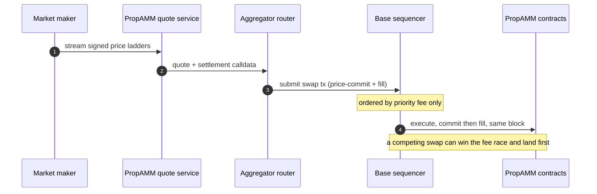
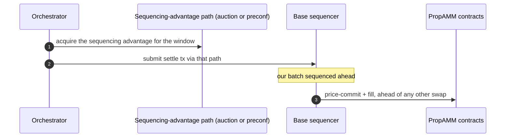
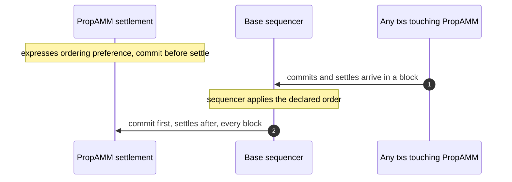

# PropAMM and transaction ordering on Base

This note maps how PropAMM would work with transaction-ordering primitives on Base: where they would attach in our stack, two broad approaches and how we would use each, why ordering is valuable on Base, and the questions that would help us plan.

## Background

PropAMM commits a market maker's freshly signed price on chain in the **same block** as the fill, and the contract rejects any price older than the current block. That closes the cross-block stale-price vector.

What remains is intra-block. Today nothing guarantees our price-commit is ordered ahead of an adverse swap except winning the priority-fee race. Any mechanism that lets our commit land first would take that contest off the gas auction. What then remains is only how far the market moves between our commit and the fill inside that window, which we shrink by committing more often.

The property we care about, stated independent of any mechanism:

> If our price-commit is ordered ahead of fills against our contract within a block or sub-block, then those fills settle against a price no older than that window's commit. Ordering the commit first closes the cross-block and ordering-race vectors. What is left is the price drift between commit and fill inside the window, which narrows as our cadence tightens, rather than an open-ended loss to whoever wins the gas auction.

## Where ordering would attach in our stack

PropAMM is two contracts and an off-chain quote service:

- **PropAMMSettlement** is the swap entrypoint (dispatches the route's steps, enforces the delivery floor).
- **PropAMMExecutor** holds the price-commit (`updatePrices`) and the fill (`fillFromAnchor`), and enforces same-block freshness (`commitBlock == block.number`). Both entrypoints are permissionless.

In production, whoever executes the swap submits one transaction containing both the price-commit and the fill, as consecutive steps of the same `swap` call. Commit and fill are already atomic inside that transaction. The place an ordering primitive would help is at the **block** level: making sure the commit lands ahead of anything else in the block that could consume the anchor.

Note that the submitter is typically an aggregator's router rather than us, since integrators execute their own routes. So the ordering question is not "can Biconomy get priority" but "can a price-commit be ordered ahead of fills against the same anchor, whoever submits it".



The `updatePrices` price-commit and the same-block freshness check are the two hooks any ordering mechanism would interact with. Both already exist and are live on Base Sepolia.

## How our stack would use ordering: two broad approaches

We sketch each against the integration points above.

### Approach 1: a sequencing advantage, acquired per window

Concrete designs in this category include priority auctions, express lanes, and preconfirmations: a submitter acquires earlier placement for a block or sub-block window. The clearest live example today is Arbitrum's Timeboost, where a sealed-bid second-price auction sells a 60-second "express lane" whose transactions are sequenced ahead of the rest, with regular transactions delayed by 200ms. It grants a time head start, not a guaranteed top-of-block slot in every block.

How we would use it: the orchestrator submits its settle batch through whatever advantage path exists, so our price-commit is sequenced ahead of competing fills, which then settle against the price we just committed. With a head-start mechanism this holds per window rather than as a hard guarantee in every block, which is already enough to take the contest off the gas auction.



On our side this is a submission-path change only, no contract change. It composes with the architecture we run today, so it is the approach we could adopt first.

### Approach 2: application-declared ordering, a standing rule

Concrete designs in this category let a contract express an ordering preference that the sequencer honors, for example "for transactions touching this contract, the price-commit is ordered before the settle." A standing rule rather than a per-window acquisition.

How we would use it: PropAMMSettlement expresses that its price-commit precedes its settle calls. Any block containing transactions to PropAMM would order the commit first, regardless of who submitted the fills. That also opens a cleaner architecture: price-commits as standalone transactions we publish every block, with fills submitted by integrators carrying no commit of their own, still settling against a same-block, first-ordered anchor. That would cut roughly 79k gas of commit cost out of every fill. The executor's entry points are already permissionless, so this needs no contract change on our side.



One illustrative way we might express this on our side, if such a primitive existed:

```solidity
interface ISequencingPolicy {
    // Selectors to order first, within a block, for txs to this contract.
    function orderingPolicy() external view returns (bytes4[] memory firstSelectors);
}
// PropAMMSettlement.orderingPolicy() returns [updatePrices.selector]
```

This is a larger change on our side and depends on such a primitive existing, so it is a longer-term direction rather than a near-term step.

## Why this matters for Base

Price ordering is not only useful to us. A few reasons we think it is worth Base prioritizing, some of which you likely already see:

- **Better prices for Base users.** Market makers that cannot be picked off on stale quotes can quote tighter. Tighter quotes mean better execution, which keeps more trading on Base.
- **Attracts professional liquidity.** Reliable intra-block ordering is something serious market makers expect. Offering it makes Base a more natural home for on-chain market making than chains that leave ordering to a gas auction.
- **A general primitive, not a one-off.** Anything that needs deterministic intra-block ordering benefits, including oracle updates, liquidations, and on-chain auctions. It is shared infrastructure, not a PropAMM feature.

## What we bring

Already in place on our side: the `updatePrices` price-commit, the same-block freshness check, and a submission path we can point at a sequencing-advantage mechanism. The contracts are deployed on Base mainnet and Base Sepolia today, so we can integrate and test against a real ordering primitive quickly.

## Questions for Base

- Would Base start with Approach 1, and is there an auction design you would recommend we build against?
- Is application-declared ordering (Approach 2) on Base's roadmap, and how do you weigh it against sequencer neutrality?
- What is the smallest ordering primitive Base could expose that we could start integrating against soon, even in a limited form?

We will keep iterating as Base's ordering story takes shape, and we are happy to compare notes whenever useful.

## References

- Arbitrum Timeboost: <https://docs.arbitrum.io/how-arbitrum-works/timeboost/gentle-introduction>
